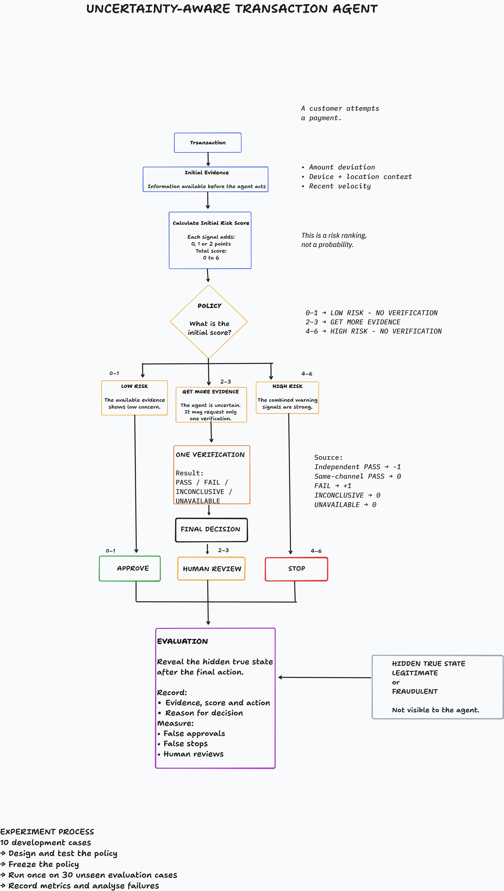

# An Uncertainty-Aware Transaction Agent: Learning When Evidence Is Enough

**Project report version:** 1.0  
**Status:** Complete draft for project-owner review  
**Scope:** Small, auditable simulation; not a production fraud system

## Abstract

Fraud decisions have to be made before the real outcome of a transaction is
known. A normal-looking payment can be fraudulent, while a legitimate purchase
can look unusual because a customer is travelling, using a different phone,
buying something expensive or making several purchases close together.

This project studies a narrow question than “Can I build a perfect fraud
detector?” 
The question is whether an agent can use uncertainty more carefully:
act immediately when the evidence is strong enough, request one useful check
when the case is uncertain, and defer to a human when the remaining evidence
does not support a safe automatic action.

I compared three transparent policies on designed transaction scenarios. The
baseline used a fixed 0–6 risk score. 
Policy 1 requested one verification for borderline scores and treated every PASS as reassuring. 
Policy 2 changed onething: a PASS reduced risk only when it came from an independent channel.
On the final thirty-case v0.2 evaluation, Policy 2 reduced human reviews from 19
to 12 and reduced Policy 1’s false approvals from 7 to 4. However, the baseline
had only 3 false approvals. Policy 2 therefore failed one frozen success
criterion and was not declared better for the complete objective. The negative
result is useful because it shows that evidence independence helps, but does
not turn verification into proof of authorization.

## 1. The problem in plain language

The agent receives one transaction at a time. It can see a small set of warning
signals, but it cannot see whether the payment is truly 
legitimate or fraudulent. 
That hidden state is revealed only after the agent has finished its
decision.

The available final actions are:

- `APPROVE`: allow the transaction;
- `HUMAN_REVIEW`: admit that the automatic evidence is insufficient;
- `STOP`: interrupt this transaction.

The agent may also use `GET_MORE_EVIDENCE`, but this is an intermediate action,
not a final answer. It is allowed to request at most one verification result.

The central research question is:

> Can an uncertainty-aware policy reduce unnecessary human review without
> increasing fraudulent approvals or stopping legitimate customers?

This objective deliberately has more than one metric. Reducing review by
approving everything would be easy, but unsafe. Stopping everything would also
avoid fraudulent approvals, but would harm legitimate customers. A useful
policy has to manage the trade-off rather than hide it inside one accuracy
number.



## 2. What changed after research and discussion

The starting idea was a simple threshold system using amount, device and
location information. Research and public discussions changed that design in
several practical ways.

First, an unusual location was made contextual rather than decisive. A traveller
with a new phone can produce several warnings from one legitimate change. To
avoid counting the same cause twice, device and location were combined into one
evidence category.

Second, recent transaction velocity was moved into the initial evidence. A
rapid sequence can be useful at decision time, although it still cannot prove
fraud because legitimate shopping can also be fast.

Third, verification became a deliberate intermediate action. Borderline cases
do not have to move directly to human review, but obtaining more information is
not free. It creates latency, customer friction and operational cost. The first
policies therefore use a strict limit of one request.

Finally, familiar behaviour was separated from authorization. A known phone,
usual location or familiar merchant tells us that the context looks normal; it
does not tell us who is controlling the device. This distinction later became
central to the failure analysis.

The research sources and the project’s own public discussions are recorded in
`docs/research-file.md` and `docs/discussion-record.md`. Individual online
comments were treated as design challenges and research leads, not as evidence
for universal fraud rates or banking thresholds.

## 3. Frozen agent design

### 3.1 Hidden states

Each simulated case has exactly one hidden state:

- `LEGITIMATE`: the expected customer authorized the payment;
- `FRAUDULENT`: the payment was unauthorized or deliberately fraudulent.

The label is never supplied to the agent. It is used by the evaluator only
after a final action. `UNKNOWN` is not a third real-world state; it describes
the agent’s lack of knowledge.

### 3.2 Initial evidence

The agent receives three intentionally small evidence categories:

1. `amount_deviation` — how unusual the amount is for the customer;
2. `device_location_context` — a combined view of device and location;
3. `recent_velocity` — whether recent activity is unusually frequent.

Each category contributes 0, 1 or 2 risk points, producing a total from 0 to 6.
This is an ordinal risk index: a score of 4 represents more warning evidence
than a score of 2. It is not a 67% fraud probability, and rescaling it to 0–100
would not make it calibrated.

### 3.3 Action bands

The frozen action bands are:

| Score | Baseline action | Policy 1 and Policy 2 initial action |
|---:|---|---|
| 0–1 | APPROVE | APPROVE |
| 2–3 | HUMAN_REVIEW | GET_MORE_EVIDENCE |
| 4–6 | STOP | STOP |

After the single verification, Policies 1 and 2 apply the same final bands:
0–1 approve, 2–3 human review and 4–6 stop.

## 4. Policy evolution

### 4.1 Baseline: a transparent static policy

The baseline adds the three evidence values and acts directly from the score.
It is intentionally simple, but not designed to fail artificially. It uses all
three initial signals and provides an understandable comparison for later
policies.

### 4.2 Policy 1: request one verification

Policy 1 requests verification only for an initial score of 2 or 3. A PASS
subtracts one point, a FAIL adds one point, and an inconclusive or unavailable
result leaves the score unchanged. The agent then makes a terminal decision.

This reduced human review on the v0.1 evaluation, but it created a new false
approval: a compromised device returned PASS through the same channel that was
already under suspicion. That result motivated Policy 2.

### 4.3 Policy 2: consider where the PASS came from

Policy 2 keeps the same evidence, points, thresholds and one-request limit. Its
only intended change is how PASS is interpreted:

- independent PASS: subtract one point;
- same-channel or unknown-source PASS: no change;
- FAIL: add one point;
- inconclusive or unavailable: no change.

The rule is asymmetric on purpose. A failed check remains a warning, while a
successful check is reassuring only when it is not simply allowing a possibly
compromised environment to confirm itself.

## 5. Dataset and experimental boundary

The cases are designed simulations, not sampled bank transactions. They were
created to cover behaviours that a simple rule can easily misunderstand:
legitimate travel, large purchases, fast legitimate shopping, card testing,
account takeover, familiar-context fraud, misleading verification, missing
evidence and correlated signals.

Each version contains forty reviewed cases:

| Version | Development | Evaluation | Purpose |
|---|---:|---:|---|
| v0.1 | 10 | 30 | Baseline and Policy 1 |
| v0.2 | 10 | 30 | New Policy 2 hypothesis |

Development cases were available while designing each policy. Evaluation cases
were reserved until the relevant policy, parameters and code had been frozen.
The hidden label was never passed into the policy. The project also records
file hashes around the Policy 2 evaluation and protects its runner against an
accidental second “unseen” run.

The balanced scenario coverage is useful for logic testing but does not
represent real fraud prevalence. Therefore the reported percentages describe
only these simulations.

## 6. Results

### 6.1 v0.1: Baseline versus Policy 1

Both frozen policies processed the same thirty v0.1 evaluation cases.

| Metric | Baseline | Policy 1 |
|---|---:|---:|
| Human reviews | 10 | 6 |
| Automatic decisions | 20 | 24 |
| False approvals | 3 | 4 |
| False stops | 0 | 0 |
| Automatic coverage | 66.7% | 80.0% |
| Automatic accuracy | 85.0% | 83.3% |

Policy 1 successfully reduced human review, but false approvals increased from
3 to 4. It therefore failed the frozen safety condition and was not declared
better than the baseline. Automatic accuracy is calculated only over APPROVE
and STOP decisions; human review is deferred and is not counted as correct.

### 6.2 v0.2: Baseline versus Policy 1 versus Policy 2

The three frozen policies then processed the same thirty new v0.2 evaluation
cases.

| Metric | Baseline | Policy 1 | Policy 2 |
|---|---:|---:|---:|
| Human reviews | 19 | 7 | 12 |
| Automatic decisions | 11 | 23 | 18 |
| False approvals | 3 | 7 | 4 |
| False stops | 0 | 0 | 0 |
| Automatic coverage | 36.7% | 76.7% | 60.0% |
| Automatic accuracy | 72.7% | 69.6% | 77.8% |

Policy 2 moved five same-channel PASS cases from Policy 1 approval to human
review. Three of those five were fraudulent, showing that the independence
rule repaired a real failure mechanism. It reduced Policy 1’s false approvals
from 7 to 4 and reduced the baseline’s review count from 19 to 12.

However, Policy 2 still produced one more false approval than the baseline.
Eight of nine frozen criteria passed, but the false-approval criterion failed.
The correct experimental conclusion is therefore:

> Policy 2 is safer than Policy 1 in this simulation, but it is not better for
> the complete frozen objective.

The result is not repaired by tuning Policy 2 on the same thirty cases. Those
cases are now seen evidence.

## 7. What the failures taught us

Four Policy 2 transactions were falsely approved.

- `P2-019` used a known phone near the customer’s home. Normal-looking device
  possession did not establish customer authorization.
- `P2-023` involved unauthorized family-device use. A mild amount warning was
  not enough to enter the verification region.
- `P2-029` passed an independent verification despite being fraudulent.
  Independence improved provenance, but did not guarantee correctness.
- `P2-033` resembled familiar customer behaviour. Behavioural continuity did
  not prove that the current user was authorized.

These are not all the same threshold problem. Three cases expose missing
identity or consent evidence. One exposes imperfect verification reliability.
Lowering the approval boundary after seeing these cases could also send many
legitimate transactions into review, so it would not be an honest general
solution.

The most defensible next investigation would be a new version with explicitly
defined identity, session-integrity or verification-reliability evidence and a
new unseen evaluation set.

## 8. Probability and belief updating

The implemented policies use points rather than probabilities. To demonstrate
what an actual belief update would require, the project contains one separate
Bayesian worked example in `decisions/probability-decision-record.md`.

That example begins with an assumed 30% fraud belief for a development case and
uses explicitly assumed verification likelihoods. After an independent PASS,
Bayes’ rule produces an illustrative posterior fraud belief of 8.7%. The
example is useful for showing the mechanics of prior, likelihood, posterior and
cost-sensitive action thresholds. It is not calibration evidence because the
prior, likelihoods and costs were not estimated from comparable production
data.

A future probability-producing agent would need enough comparable labelled
cases, out-of-sample probability predictions and calibration measures such as
reliability curves or Brier score. Those measures would be misleading for the
current point-based agent.

## 9. Human control and responsible interpretation

The affected people are not represented by one metric. A false approval can
harm customers, merchants and payment providers. A false stop interrupts a
legitimate customer. Human review creates workload and delay, while additional
verification adds friction.

In this project, `STOP` means stopping one simulated transaction. It does not
mean closing an account, accusing a customer or taking an irreversible action.
A production system would need clear notification, appeal, recovery and human
support procedures.

Other important limitations are:

- the data is designed and small;
- real fraud prevalence and monetary costs are not estimated;
- review capacity, queue time and service levels are not modelled;
- verification independence is assumed to be available and correctly labelled;
- final fraud labels may be delayed or selected by earlier policies;
- binary hidden states omit fraud subtypes and non-fraud payment failures.

The project should therefore be read as an experiment in decision structure,
not a claim of production fraud-detection performance.

## 10. Reproducibility and checks

The repository contains the specifications, versioned data dictionaries,
master cases, deterministic development/evaluation splits, policy code, tests,
frozen parameters, decision CSV files, metric JSON files and failure analysis.

The complete software test suite contains 71 automated checks. These are code
checks for scoring boundaries, input validation, hidden-label leakage,
verification limits, dataset separation, hashes and output protection. They are
not 71 transaction cases.

The test suite can be run from the repository root with:

```powershell
python -m unittest discover -s tests -v
```

The held-out evaluations have already been executed. Running their calculations
again may reproduce them, but cannot create another independent unseen result.

## 11. Conclusion

The project began as a small score-based fraud rule and became a more explicit
decision system. It separates hidden truth from observed evidence, separates
the risk representation from the action policy, limits evidence collection,
records why each action was taken and freezes policies before evaluation.

Policy 1 showed that collecting more evidence can reduce human review while
also creating new errors. Policy 2 showed that the source of evidence matters:
a same-channel PASS should not automatically reduce concern. Yet an independent
PASS can still be wrong, and normal-looking context can still hide unauthorized
use.

The most important result is not that one policy “won.” It is that every
improvement claim was tested against frozen conditions and the failed condition
was kept visible. That is the behaviour expected from an uncertainty-aware
project: make assumptions explicit, learn from evidence, and avoid claiming
more certainty than the experiment supports.

## References and project evidence

1. Project research record: `docs/research-file.md`.
2. Project discussion record: `docs/discussion-record.md`.
3. Frozen specifications: `docs/v0.1-spec.md` and `docs/v0.2-spec.md`.
4. Policy 2 hypothesis: `docs/policy2-hypothesis.md`.
5. Held-out comparisons: `results/v0.1/baseline-vs-policy1-evaluation-summary.md`
   and `results/v0.2/baseline-vs-policy1-vs-policy2-evaluation-summary.md`.
6. Failure analysis: `docs/failure-analysis.md`.
7. Probability decision record: `decisions/probability-decision-record.md`.
8. Dan Holloran, “Payment Fraud Detection and the False Decline Problem,”
   linked and discussed in the research record.
9. MIT News, “Reducing false positives in credit card fraud detection,” linked
   and discussed in the research record.
10. WSO2, “A Deep Dive of Transaction Risk Analysis for Open Banking and PSD2,”
    linked and discussed in the research record.

## AI-use and evidence note

AI tools helped organise the research, generate code drafts, review documents
and improve explanations. The project owner remains responsible for
understanding every rule and confirming the recorded review dispositions.
Public-discussion requirements are reported separately and remain incomplete
unless the linked contributions and reply counts are genuinely verified.
